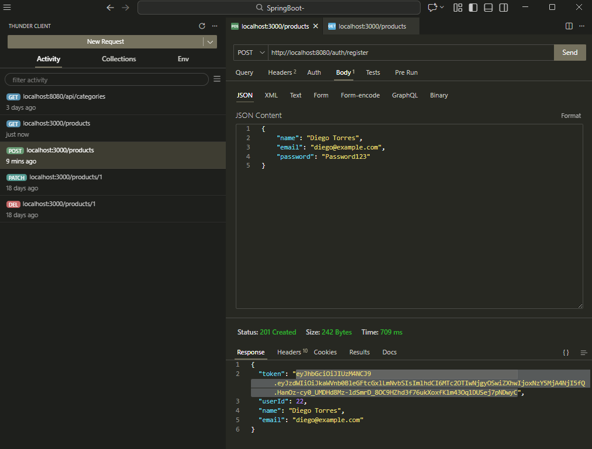
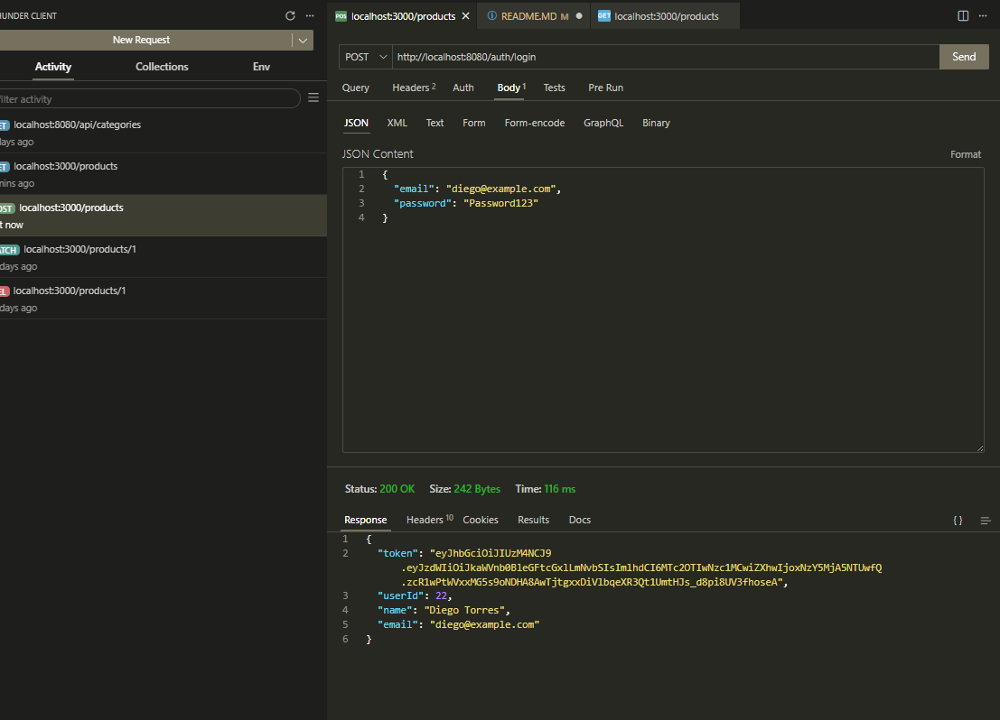
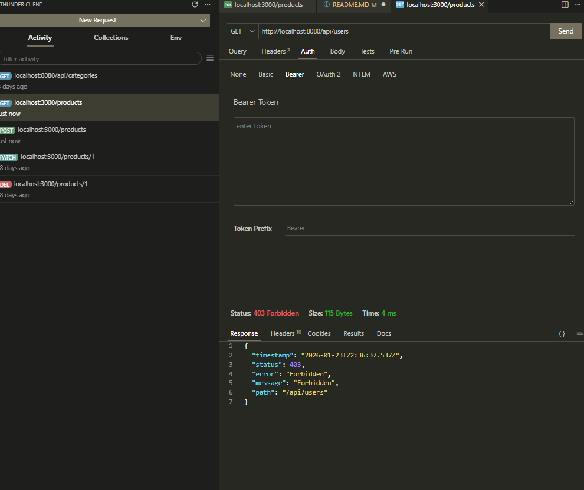
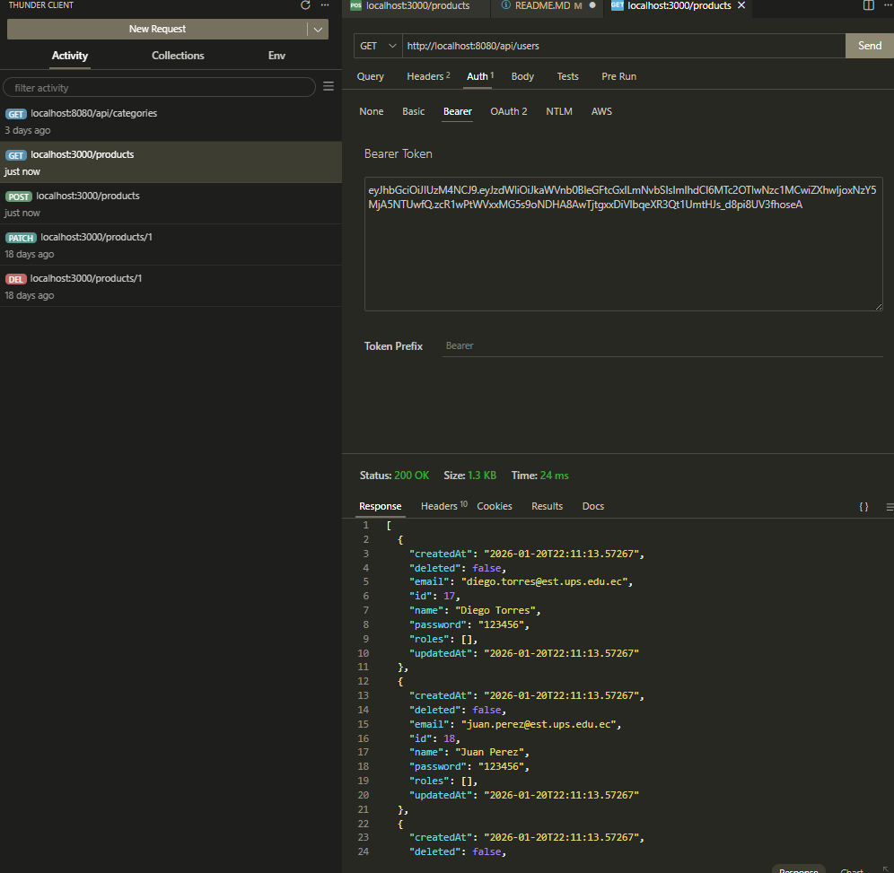

---

## **Práctica 11: Implementación de Seguridad con Spring Security y JWT**

En esta práctica, se transformó la aplicación **Springboot01** de una API abierta a un sistema seguro basado en el estándar industrial **JWT (JSON Web Token)**. Se implementó una arquitectura **Stateless** (sin estado), donde la identidad del usuario se verifica en cada petición mediante tokens firmados digitalmente.

### **Características Principales:**

* **Autenticación Stateless**: Uso de JWT para manejar sesiones sin sobrecargar el servidor.
* **Seguridad de Contraseñas**: Implementación de **BCrypt** para el hashing de credenciales en la base de datos.
* **Gestión de Roles**: Sistema de permisos basado en roles (**ROLE_USER**, **ROLE_ADMIN**) con una relación ManyToMany.
* **Filtros Personalizados**: Interceptación de peticiones para validar la autenticidad del token antes de llegar a los controladores.

---

### **Evidencias del Funcionamiento**

#### **1. Registro de Usuario (`POST /auth/register`)**

Se observa el flujo de creación de una cuenta nueva. El sistema valida que el correo sea único y devuelve el primer token de acceso junto con los datos del usuario registrado. El estado **201 Created** confirma que la persistencia y la generación del JWT fueron exitosas.

#### **2. Inicio de Sesión (`POST /auth/login`)**

Demostración de la validación de credenciales. Al proporcionar el email y la contraseña correcta, el `AuthenticationManager` verifica el hash en la base de datos y genera un token válido por 30 minutos.

#### **3. Protección de Endpoints (Prueba SIN TOKEN)**

Para verificar la robustez del sistema, se intentó consumir el recurso protegido `api/users` (o `api/products`) sin enviar el header de autorización. El servidor rechaza la petición con un error **401 Unauthorized** o **403 Forbidden**, demostrando que los filtros de seguridad están activos.

---

### **Conclusión**

La API ahora cuenta con un "portero" digital que garantiza que solo usuarios autenticados puedan interactuar con los recursos sensibles, cumpliendo con los requisitos de seguridad y control de acceso exigidos en plataformas web modernas.

---
